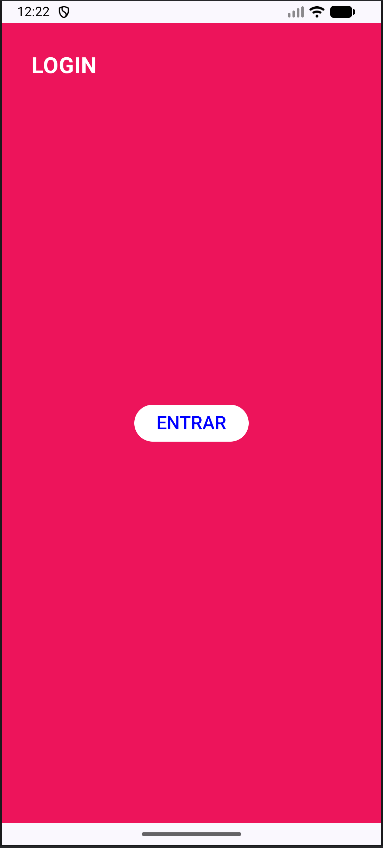
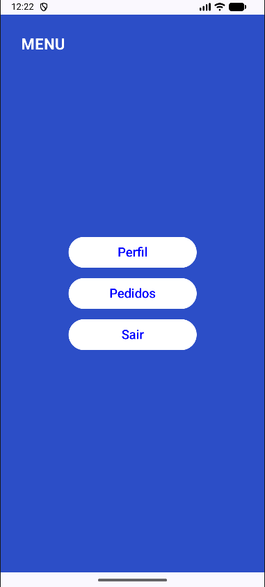
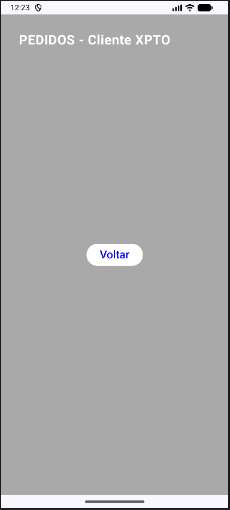
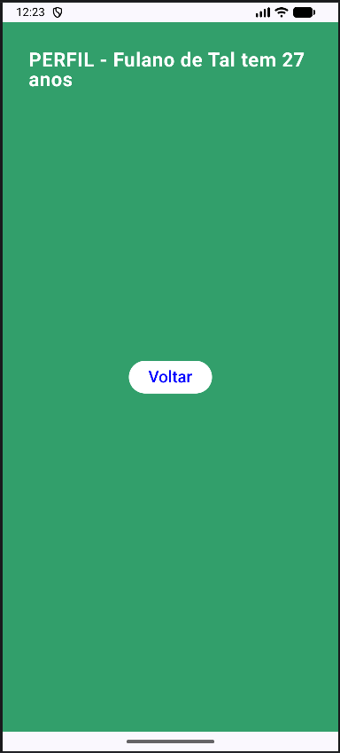

# Screen Flow Navigation

Aplicativo Android desenvolvido com **Jetpack Compose** que demonstra a navegação entre telas utilizando o **Navigation Compose**. O projeto explora diferentes formas de passagem de parâmetros entre telas (argumentos obrigatórios, opcionais e com valores padrão).

## Tecnologias Utilizadas

- **Kotlin**
- **Jetpack Compose**
- **Navigation Compose** (`androidx.navigation:navigation-compose`)
- **Material 3**
- **Android SDK 36** (mínimo: SDK 24)

## Estrutura do Projeto

```
app/src/main/java/com/github/victoruizz/screen_flow_navigation/
├── MainActivity.kt          # Activity principal com configuração do NavHost
├── screens/
│   ├── LoginScreen.kt       # Tela de login (tela inicial)
│   ├── MenuScreen.kt        # Tela de menu com navegação para outras telas
│   ├── PedidosScreen.kt     # Tela de pedidos (argumento opcional: cliente)
│   └── PerfilScreen.kt      # Tela de perfil (argumentos obrigatórios: nome e idade)
└── ui/theme/
    ├── Color.kt
    ├── Theme.kt
    └── Type.kt
```

## Fluxo de Navegação

```
Login ──> Menu ──> Pedidos
                ──> Perfil
```

O app inicia na tela de **Login**. Ao clicar em "ENTRAR", o usuário é direcionado ao **Menu**, que oferece três opções:

| Botão     | Destino  | Parâmetros                                  |
|-----------|----------|---------------------------------------------|
| Perfil    | Perfil   | Sem parâmetros (usa valores padrão)         |
| Pedidos   | Pedidos  | `cliente` = "Cliente XPTO" (query param)    |
| Sair      | Perfil   | `nome` = "Fulano de Tal", `idade` = 27      |

### Tipos de passagem de parâmetros demonstrados

- **Path parameters** (obrigatórios): `perfil/{nome}/{idade}`
- **Query parameters** (opcionais com default): `pedidos?cliente={cliente}`

## Telas

### Login
Tela inicial com fundo rosa e botão "ENTRAR" que navega para o Menu.

<p align="center">
  
</p>

---

### Menu
Tela com fundo azul contendo três botões de navegação: **Perfil**, **Pedidos** e **Sair**.

<p align="center">
  
</p>

---

### Pedidos
Tela com fundo cinza que exibe o nome do cliente recebido via query parameter. Possui botão "Voltar" para retornar ao Menu.

<p align="center">
  
</p>

---

### Perfil
Tela com fundo verde que exibe o nome e a idade do usuário recebidos via path parameters. Possui botão "Voltar" para retornar ao Menu.

<p align="center">
  
</p>

## Como Executar

1. Clone o repositório
2. Abra o projeto no **Android Studio**
3. Sincronize as dependências do Gradle
4. Execute o app em um emulador ou dispositivo físico com Android 7.0+ (API 24)
